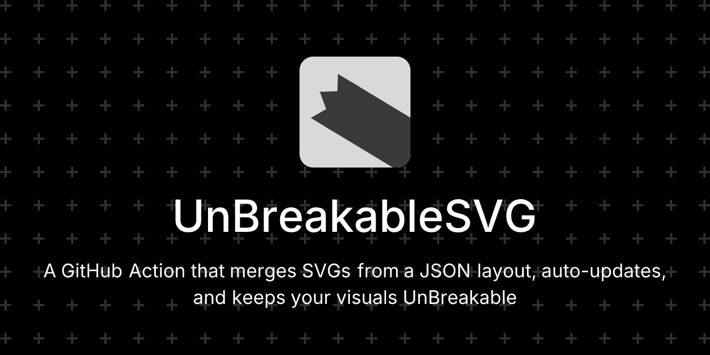

# UnBreakableSVG



## Sample Usage


## Why UnBreakableSVG?
After spending hours perfecting an SVG layout, nothing’s more frustrating than seeing a broken image in your README or on your site. **UnBreakableSVG** solves that problem by turning your SVG files into a reliable, automated asset. It composes, scales, and refreshes your SVGs from a single JSON layout and can auto-commit updates on a schedule.

## Features
- **Smart Layout Control:** Define where and how each SVG appears using a lightweight JSON layout.
- **Accurate Scaling:** Each element scales automatically based on its target width/height.
- **Custom Backgrounds:** Support for solid or transparent backgrounds with rounded corners.
- **Auto Updates:** A built-in scheduler regenerates and pushes fresh merged SVGs every 6 hours.
- **Fully CI/CD Ready:** Works out of the box with GitHub Actions using Node.js 18+.
- **Composable:** Each element can come from a local file, base64-encoded string, or even remote SVG.


## How to use
1. Add this repo’s [`.github/workflows/merge-svgs.yml`](.github/workflows/merge-svgs.yml) to your project.
2. Edit `mergesvg-layout.json` (or use [MergeSVG](https://github.com/whiteSHADOW1234/MergeSVG)
) to specify which SVGs to merge and their sizes/positions.
3. Commit and push changes to trigger the Action to regenerate the merged SVG.
4. A scheduled workflow refreshes the merged SVG every six hours automatically.
5. Embed or reference the output (e.g. ``) in your README or website.


> [!NOTE] 
> **Scheduled Auto-Commit**
> The built-in cron job regenerates and commits merged SVGs every 6 hours:
> ```
> schedule:
>   - cron: '0 */6 * * *'
> ```
> You can adjust the interval or disable commits by editing the workflow file.


## Quick Start Command (Local)
You can also run the merge locally:
```
npm install
node scripts/merge-layout.js --layout mergesvg-layout.json --out out/merged.svg
```


## JSON Schema
Define `mergesvg-layout.json` with the following structure (placeholders in braces):
```
{
  "canvas": {
    "width": {CANVAS_WIDTH_PX},
    "height": {CANVAS_HEIGHT_PX},
    "backgroundColor": "{CSS_COLOR}",
    "transparency": {ALPHA_0_TO_1},
    "pattern": "{PATTERN_OR_none}",
    "gridSize": {GRID_SIZE_PX},
    "gridColor": "{GRID_COLOR}"
  },
  "elements": [
    {
      "name": "{OPTIONAL_LABEL}",
      "remoteUrl": "{HTTP_URL_OPTIONAL}",
      "content": "{SVG_RAW_CODE_BASE64_ENCODED}",
      "position": { "x": {X_PX}, "y": {Y_PX} },
      "dimensions": { "width": {WIDTH_PX}, "height": {HEIGHT_PX} }
    }
  ],
  "version": "{OPTIONAL_VERSION}",
  "exportedAt": "{OPTIONAL_ISO_DATETIME}"
}
```

#### Field notes
- Source fields: provide at least one of `remoteUrl`/`remoteURL` or `content`.
- Resolution order: `remoteUrl` → cached `out/remotes/<sha1(remoteUrl)>.svg` → `content`.
- Coordinates and sizes (`x`, `y`, `width`, `height`) are pixels.
- `remoteUrl` or `remoteURL`are all supported.

> [!NOTE]
> ### How to fill placeholders
> - Replace the braces with your actual values; do not keep the `{...}`.
> - Keep quotes only for string values; do not quote numbers or booleans.
>   - Example: `"width": 848` (number), `"backgroundColor": "#ffffff"` (string), `"transparency": 0.5` (number).

After the workflow runs, you’ll get an auto-generated file at: `out/merged.svg`, which looks exactly like your defined layout and will be refreshed automatically on schedule.


## Contributing
Pull requests and Issues are welcome!

## License
This project is licensed under the MIT License. See [LICENSE](LICENSE) for details.
